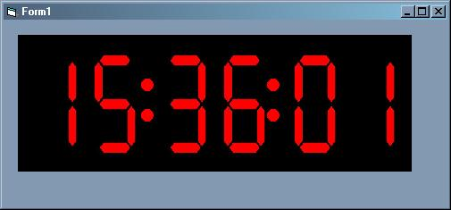



## Digital Clock Event Timer

### Description

Digital Clock, which also will fire a Time Reached event for 'triggers' that you can set up during design time, runtime, or even from the control itself during run time. This clock has four user options, which can be locked with it's properties. By clicking on the Clock Numbers, you can change the Colors from Red to Blue to Green. Right Clicking on the clock numbers will change it from 12 to 24 hour time. Clicking on the clock's colons will display the 'trigger events' you have set up, and left clicking on the clock's colons will allow you to add/modify/edit the trigger events. Please rate this code!
 
### More Info
 
The TimeReached event needs at least one time, hour, minute, and second.

DO NOT ASSUME THIS IS MORE EFFICIENT THEN A TIMER CONTROL. It can't be, since it has a timer control in it. It is just an expansion on top of a timer control. In fact, there is no way to get around what a Timer control does, counting clock ticks.

When the TimeReached Event fires, it will return which 'trigger' it is firing for. An easy way to have different code run at different times.

May cause you to stop using the Plain Timer Control. (unless you need to run something every minute or so.)

             |
---                |---
**Submitted On**   |2000-08-24 11:15:18
**By**             |[Drew Wutka](https://github.com/Planet-Source-Code/PSCIndex/blob/master/ByAuthor/drew-wutka.md)
**Level**          |Intermediate
**User Rating**    |5.0 (20 globes from 4 users)
**Compatibility**  |VB 5\.0, VB 6\.0
**Category**       |[OLE/ COM/ DCOM/ Active\-X](https://github.com/Planet-Source-Code/PSCIndex/blob/master/ByCategory/ole-com-dcom-active-x__1-29.md)
**World**          |[Visual Basic](https://github.com/Planet-Source-Code/PSCIndex/blob/master/ByWorld/visual-basic.md)
**Archive File**   |[CODE\_UPLOAD92768242000\.zip](https://github.com/Planet-Source-Code/drew-wutka-digital-clock-event-timer__1-10981/archive/master.zip)

